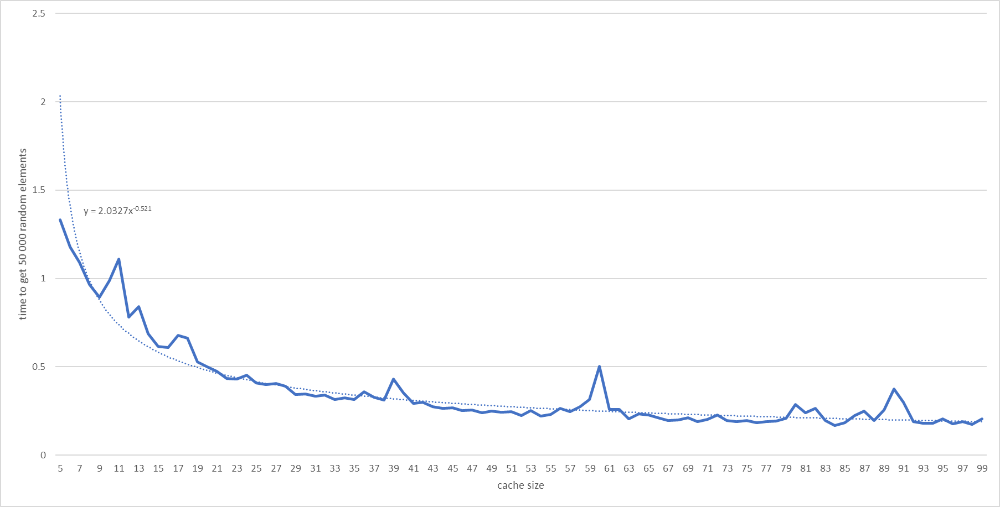
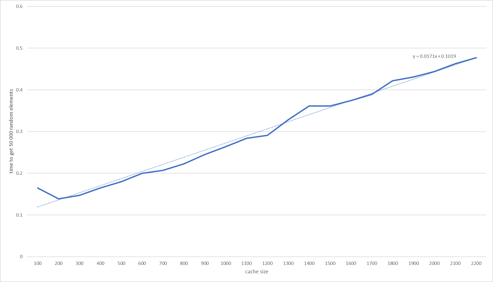

# Itroduction

A friend of mine inspired me to write this optimization of accessing particular indexes of a linked lists by caching indexes visited previously. These don't take into consideration deleting etc., it's a very basic implementation.

## Results

# Data

50 000 elements in the list, time to ask for 50 000 random indexes. Note that the times were taken from a single run and arent' very precise.

| Type | Time |
| ---- | ---- |
| regular | 4.83 s |
| one element cached | 3.036 s |
| five elements cached | 1.33 s |
| ten elements cached | 0.987 s |
| twenty five elements cached | 0.409 s |
| fifty elements cached | 0.242 s|

Here's a graph of #n elements cached items:

And here's a graph for very high size of cached items:

# Takeout

We can clearly see that cache indeed does optimize accessing to some point and then makes it slower; that's because searching in an unsorted array is linear and by increasing it's size, we icrease our times linearly.

## Q&A

### What is this?

A test of some heuristics on doubly-linked list.

### Why is it written so badly?

Cause it took half an hour.

### Why are test so meaningless?

Cause it took half an hour.

### Do you know that this data structure is not to be used like that?

Yep.

### Wow that's fascinating, can I Pay you?

[Of course.](http://paypal.me/Bartor)

