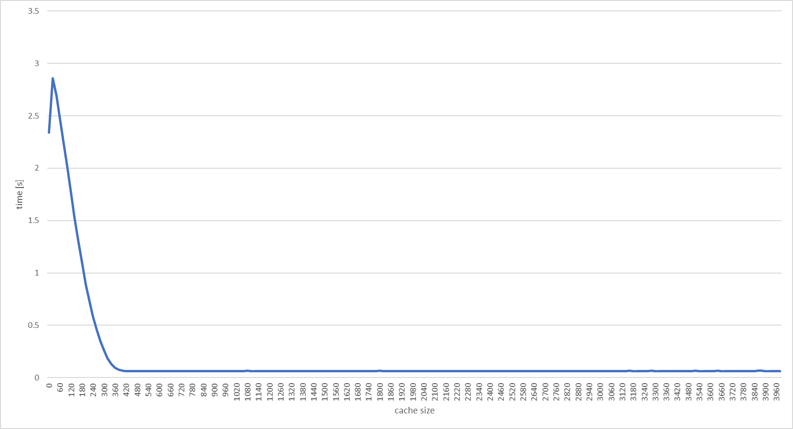
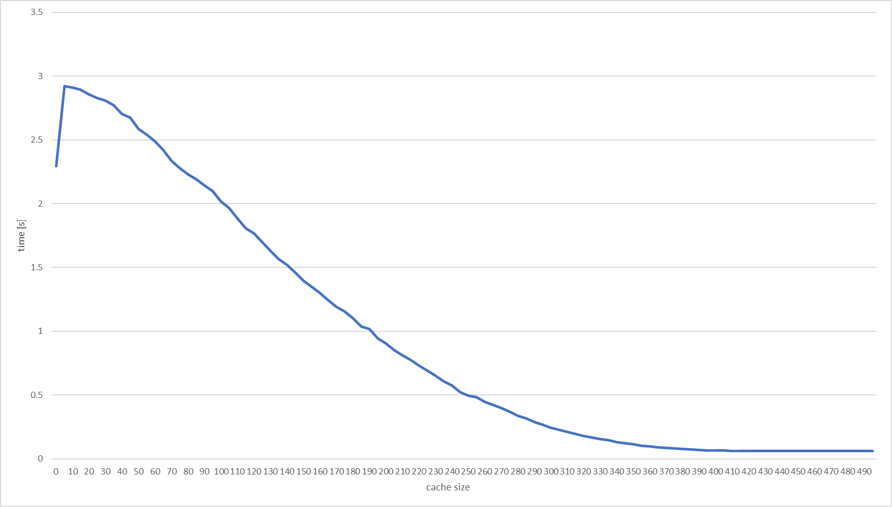
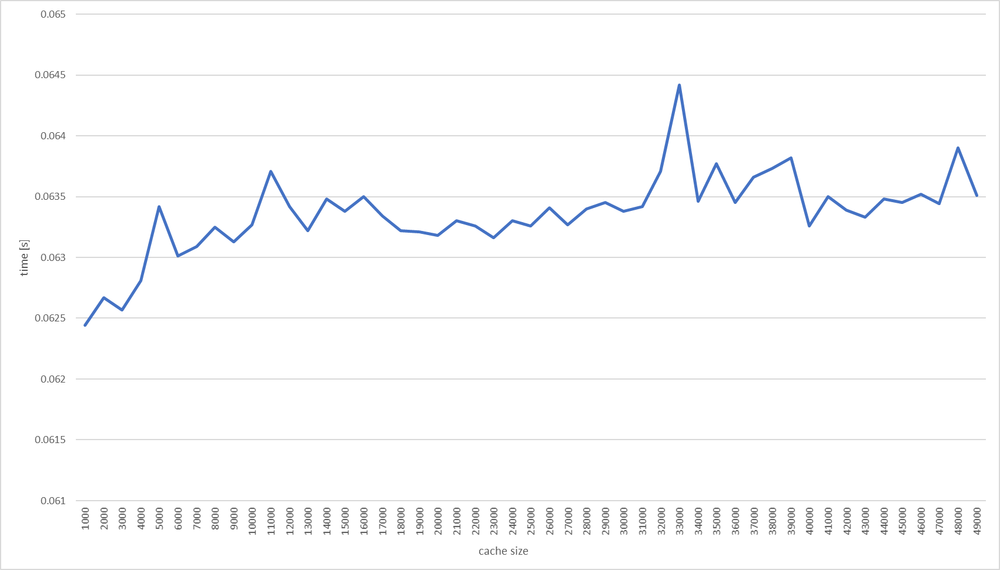

## Introduction

This is a heuristic optimization for accessing arbitrary index of a doubly-linked list.

## How does it work?

There a cache of given size which consist of pairs `(reference to the element, element's index)` sorted by the indices. They allow to binary search a closest index reference of a given index, replace that closest reference with the index it self and then return it. This way our cache stays sorted and is basically randomized.

## Why?

Because why not. We could've always used cache with `[size/n, 2*size/n, 3*size/n, ... size]` indices and it would work even better, but there's no fun in that.

## Results

We can optimize the cache size with respect to the list size. Average of ten runs with different caches on 50 000 element list:

| Cache size | Time [s] |
| ---------- | -------- |
| 0          | 2.3411   |
| 20         | 2.8548   |
| 40         | 2.6905   |
| 60         | 2.4809   |
| 80         | 2.2424   |
| 100        | 2.0068   |
| 200        | 0.8856   |
| 400        | 0.0658   |
| 800        | 0.0625   |

Whole data on a chart:

We can clearly see that the times go up for a while before getting very fast. Here's a close-up:

| Cache size | Time [s] |
| ---------- | -------- |
| 0          | 2.2921   |
| 5          | 2.9215   |
| 10         | 2.9110   |
| 15         | 2.8922   |
| 20         | 2.8556   |
| 25         | 2.8283   |
| 30         | 2.8074   |
| 35         | 2.7732   |
| 40         | 2.7021   |

So there's a spike on giving it any cache and then it steadily declines. We can also experiment and ask, if there's a cache size < list size which starts increasing the times (this one is one hundred tries):

| Cache size | Time [s] |
| 1000       | 0.0624   |
| 5000       | 0.0634   |
| 10000      | 0.0632   |
| 20000      | 0.0631   |
| 40000      | 0.0632   |

## Conclusions

We can indeed get better results with the cache as well as establish an optimal size of the cache according to the list size via some test. In our example, 50 000 element list cache size sweet spot seems to be around 400 - 450 elements. From there, there's no apparent gain in performance. There isn't even a clear performance loss when our cache size is reaching list size.

## Other examples

There's a previous version of this experiment with different implementation (no binary search on the cache) in [prev-vers folder](./prev-vers/) with example test and data.